# Getting Started with Alicorn

Alicorn is the web interface for visualizing and analyzing Unicornscan data. It
provides an intuitive dashboard for exploring scan results, tracking hosts over
time, comparing scans to detect changes, and understanding your network topology.

> **Prerequisites**: This guide assumes you have Unicornscan installed and have
> already run scans with the `-epgsqldb` module to populate the database. If you
> haven't done this yet, see [Getting Started with Unicornscan](GETTING_STARTED.md)
> first.

## 1. Quick Start

### 1.1 Starting Alicorn

If you installed via package, Alicorn is managed through the `unicornscan-web`
command:

```bash
sudo unicornscan-web start
```

This starts both the PostgREST backend and the Alicorn web server. By default,
Alicorn is available at:

```
http://localhost:31337
```

### 1.2 Navigation Overview

Alicorn's sidebar provides access to all major features:

| Section    | Purpose                                           |
|------------|---------------------------------------------------|
| Dashboard  | Overview stats, charts, and recent activity       |
| Scans      | Browse, filter, compare, and export scan data     |
| Hosts      | Aggregated host inventory across all scans        |
| Topology   | Network graph visualization                       |
| Statistics | Advanced analytics, heatmaps, and GeoIP data      |
| Settings   | Database and GeoIP configuration                  |

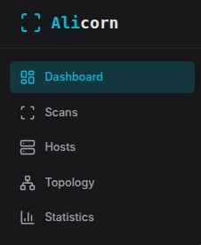

## 2. Dashboard

The Dashboard provides a high-level overview of your scan data.

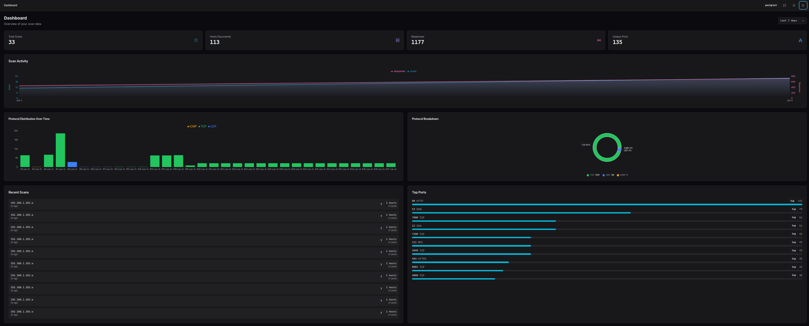

### 2.1 Time Range Selector

In the top-right corner, the time range selector filters all dashboard data:

- **24h** - Last 24 hours
- **7d** - Last 7 days (default)
- **30d** - Last 30 days
- **90d** - Last 90 days
- **All** - All time

### 2.2 Stats Overview

The stats cards at the top show key metrics for the selected time range:

- **Total Scans** - Number of scans performed
- **Hosts Discovered** - Distinct IP addresses discovered
- **Responses** - Total responses received across all scans
- **Unique Ports** - Distinct port numbers observed

### 2.3 Scan Timeline

The timeline chart visualizes scan activity over time, showing when scans were
performed and how many results each produced.

### 2.4 Protocol Distribution

Two complementary views of protocol data:

- **Bar chart** - Protocol distribution over time
- **Pie chart** - Overall protocol breakdown

### 2.5 Recent Scans & Top Ports

The bottom section shows:

- **Recent Scans** - Quick access to your latest scans
- **Top Ports** - Most frequently discovered ports across all scans

## 3. Scans

The Scans page is your central hub for managing scan data.

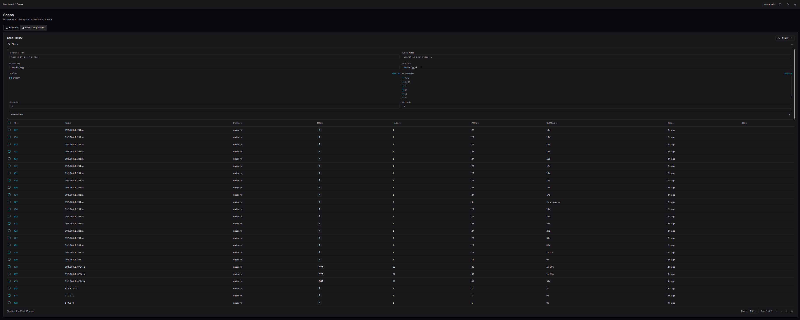

### 3.1 Browsing Scan History

The scan table displays all scans with key information:

- **Scan ID** - Unique identifier (click to view details)
- **Target** - The target specification used
- **Mode** - Scan mode (TCP SYN, UDP, ARP, etc.)
- **Ports Found** - Number of open ports discovered
- **Timestamp** - When the scan was performed

### 3.2 Filtering and Sorting

Use the filter bar to narrow down results:

- **Search** - Filter by target string
- **Mode** - Filter by scan mode
- **Date range** - Filter by time period

Click any column header to sort by that field. Click again to reverse the order.

### 3.3 Viewing Scan Details

Click a scan ID to view its detail page:

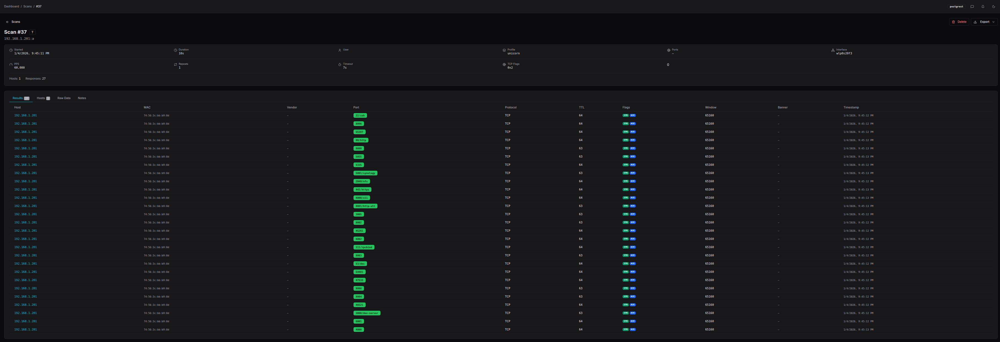

The detail page includes:

- **Results Tab** - All discovered ports with service info, TTL, and TCP flags
- **Hosts Tab** - Aggregated view by host
- **ARP Results** - Layer 2 discovery results (if ARP mode was used)
- **Traceroute** - Path data (if traceroute mode was used)
- **Raw Data** - JSON export of all scan data
- **Notes** - Add annotations to the scan

### 3.4 Exporting Scan Data

Use the export dropdown to download scan data:

- **CSV** - Spreadsheet-compatible format
- **JSON** - Machine-readable format
- **Markdown** - Documentation-friendly format

For advanced export options, click "Export Options..." to customize what fields
are included.

### 3.5 Bulk Operations

Select multiple scans using the checkboxes to:

- **Delete** - Remove selected scans from the database
- **Compare** - Open the comparison view (see Section 4)

## 4. Comparing Scans

The scan comparison feature is one of Alicorn's most powerful capabilities. It
allows you to visualize differences between multiple scans of the same target,
making it trivial to spot changes that would otherwise require complex regex
and manual comparison.

### 4.1 Why Compare Scans?

During security assessments and network monitoring, you often scan the same
targets multiple times:

- **Before and after patching** - Verify that vulnerabilities were remediated
- **Periodic monitoring** - Detect new services or unexpected changes
- **Incident response** - Compare current state to a known-good baseline
- **Change validation** - Confirm firewall rules are working as expected

In the past, spotting differences between scan-1 and scan-2 required complex
regex patterns and manual inspection. Alicorn's comparison feature makes finding
these deltas trivial.

### 4.2 Selecting Scans for Comparison

**Step 1: Select your first scan**

On the Scans page, click the checkbox next to a scan you want to compare:

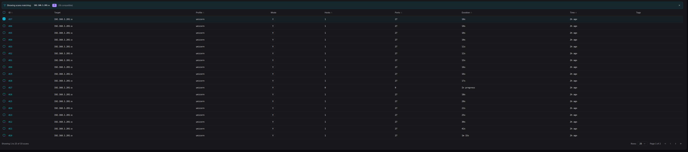

**Step 2: Notice the compatibility filter**

Once you select a scan, Alicorn automatically filters the list to show only
**compatible scans** - those with the same target and mode. This ensures
meaningful comparisons:

**Step 3: Select additional scans**

Select one or more additional scans to compare. You can compare 2 or more scans
simultaneously.

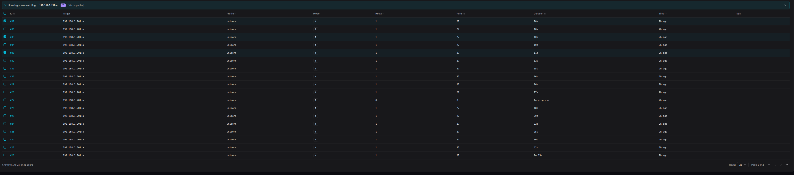

**Step 4: Click Compare**

A floating action bar appears at the bottom of the screen showing how many scans
are selected. Click the **Compare** button:

### 4.3 The Comparison Dashboard

The comparison view offers four visualization modes, each designed for different
analysis needs:

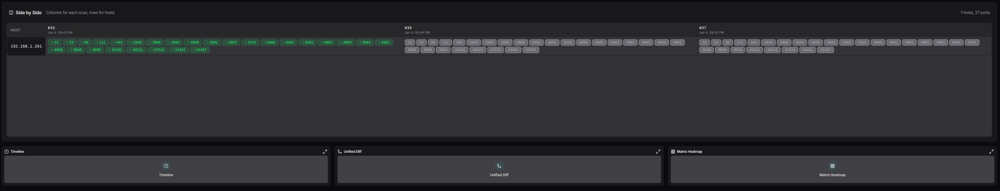

#### Side-by-Side View

Displays each scan as a column with hosts as rows. Easy to visually scan across
and spot differences:

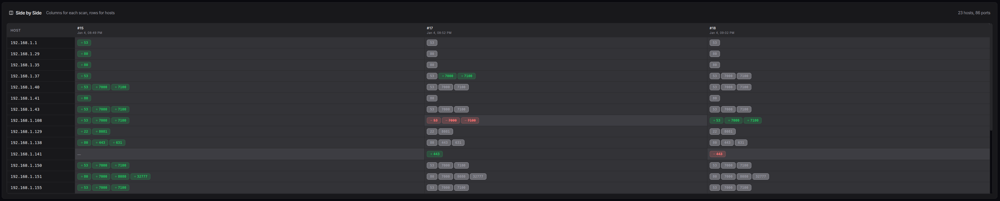

- Green highlights indicate ports that appeared (new)
- Red highlights indicate ports that disappeared (removed)
- Neutral color indicates ports present in all scans

#### Timeline View

Shows changes chronologically, making it easy to understand when services
appeared or disappeared:

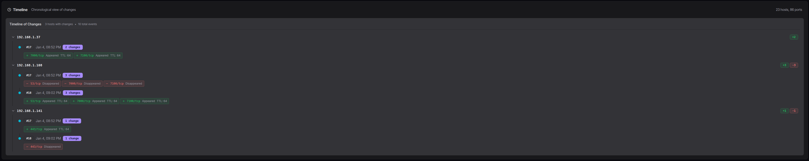

- Each row represents a host
- Time progresses left to right
- Color coding shows port state changes at each scan

#### Unified Diff View

A merged view inspired by code diff tools, showing all changes in a single
scrollable list:

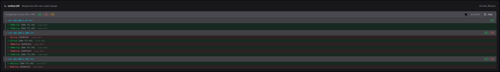

- `+` prefix and green background = added
- `-` prefix and red background = removed
- Perfect for generating change reports

#### Matrix Heatmap View

A grid visualization showing port presence across all scans at a glance:

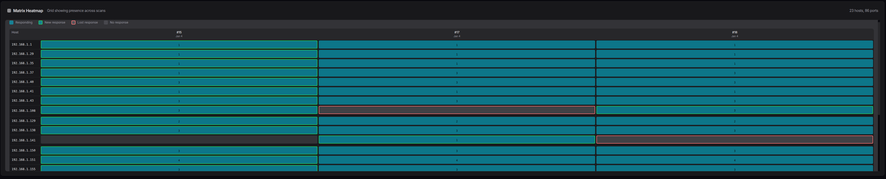

- Rows are hosts/ports
- Columns are scans
- Cell color intensity indicates presence

### 4.4 Comparison Walkthrough Example

Let's walk through a practical example: You scanned your network on Monday
and again on Friday. Something changed and you want to find out what.

**1. Go to Scans page and select Monday's scan**

The list filters to show only compatible scans.

**2. Select Friday's scan**

You now have 2 scans selected.

**3. Click Compare**

The comparison dashboard opens with the Side-by-Side view.

**4. Look for color-coded changes**

Immediately you can see:
- Host `192.168.1.50` has a new port 8080 (green)
- Host `192.168.1.100` no longer has port 22 open (red)

**5. Switch to Unified Diff for a report**

Click the Unified Diff thumbnail to see all changes in one list, perfect for
including in a report.

### 4.5 Saving and Bookmarking Comparisons

For comparisons you want to revisit, you can save them with notes:

1. In the comparison header, type a note describing the comparison
2. The comparison is automatically saved after you stop typing
3. A bookmark icon indicates it's saved

Access saved comparisons from the **Saved Comparisons** tab on the Scans page:

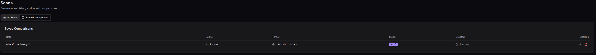

### 4.6 Exporting Comparison Results

Export your comparison analysis using the export dropdown:

- **CSV** - Tabular data with change indicators
- **JSON** - Full comparison data structure
- **Markdown** - Ready for documentation or reports

## 5. Hosts

The Hosts page provides an aggregated view of all discovered hosts across all
scans.

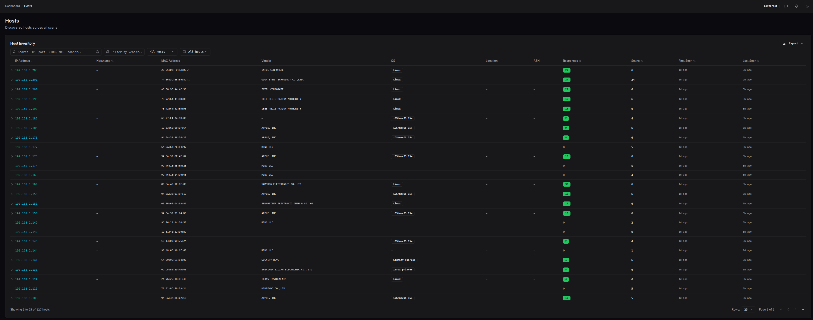

### 5.1 Host Inventory Overview

The host table shows:

- **IP Address** - Click to view host details
- **Hostname** - Reverse DNS name (if available)
- **Ports** - Number of distinct ports observed
- **Scans** - Number of scans that found this host
- **First Seen** - When the host was first discovered
- **Last Seen** - Most recent observation

### 5.2 Searching and Filtering

The search bar supports multiple query types:

- **IP address** - `192.168.1.50`
- **CIDR range** - `192.168.1.0/24`
- **Port number** - `port:22` or `port:80,443`
- **Service name** - `service:http` or `service:ssh`
- **Combined** - `192.168.1.0/24 port:22`

### 5.3 Host Detail Page

Click any host to view its complete profile:

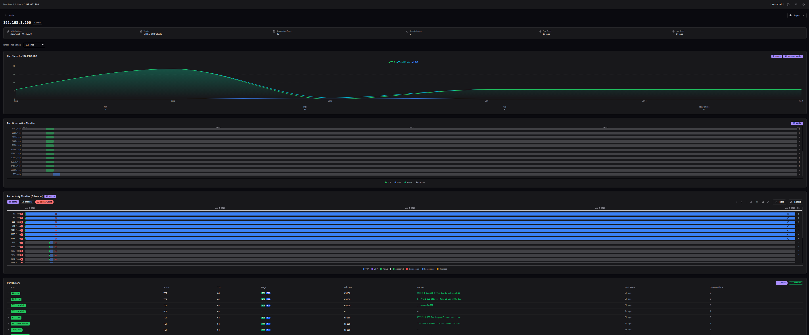

The host detail page consolidates everything known about a host in one place:

#### Port Trend Chart

Visualizes how many ports were open over time:


#### Port Timeline

Shows the lifespan of each port - when it was first and last seen:

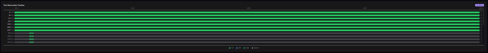

#### Enhanced Host Timeline

An interactive timeline with:

- Change detection highlighting
- Zoom and pan controls
- Filtering by port or service
- Export capability

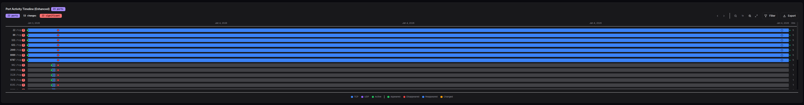

#### Port History

A detailed table of every port observation:

- Port number and protocol
- Service name
- TCP flags
- TTL value
- Observation timestamp

#### Associated Scans

List of all scans that discovered this host, with quick links to each scan's
detail page.

#### Notes

Add annotations about this host that persist across sessions.

## 6. Topology

The Topology page provides a network graph visualization of your scan data.

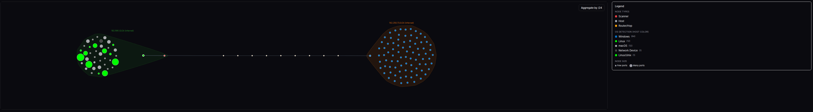

### 6.1 Global vs Scan-Specific View

- **Global view** (`/topology`) - Shows all hosts across all scans
- **Scan-specific view** (`/topology?scan_id=123`) - Shows only hosts from one scan

Access scan-specific topology from any scan's detail page.

### 6.2 Graph Interaction

- **Click** a node to see its details in the sidebar
- **Drag** nodes to rearrange the layout
- **Scroll** to zoom in/out
- **Pan** by dragging the background

### 6.3 Node Types

The graph uses different colors for node types:

- **Red** - Scanner (your scanning host)
- **Amber** - Router (identified via TTL analysis)
- **Green** - Host (discovered target)

### 6.4 Selected Node Details

When you click a node, the sidebar shows:

- IP address and hostname
- Node type (scanner, router, host)
- OS detection guess (if available)
- Port count and connection count
- TTL and estimated hops
- First/last seen timestamps
- Link to host detail page

## 7. Statistics

The Statistics page provides advanced analytics and visualizations.

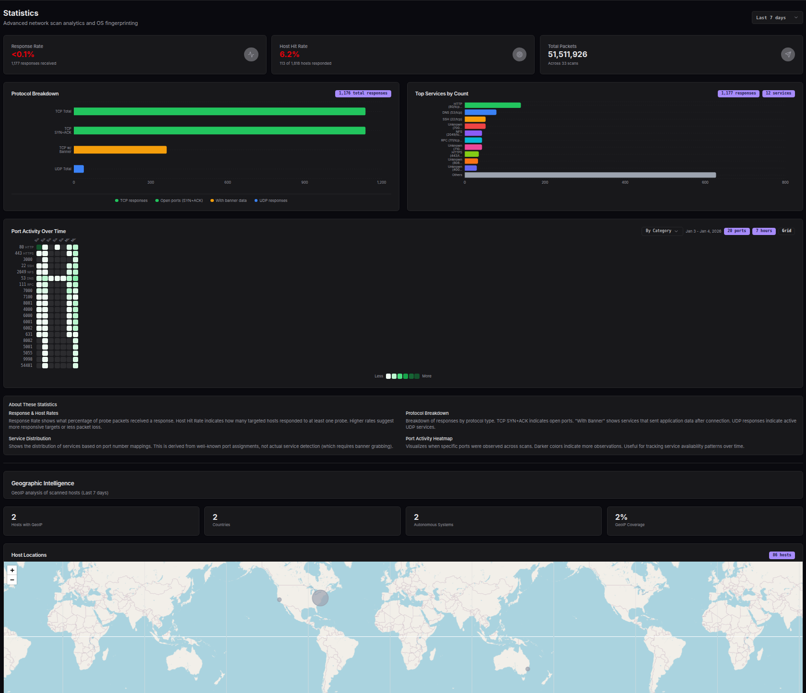

### 7.1 Scan Performance Stats

Cards showing aggregate metrics:

- **Response Rate** - Percentage of probes that received responses
- **Host Hit Rate** - Percentage of targeted hosts that responded
- **Average Ports/Host** - Mean ports discovered per host

### 7.2 Protocol Breakdown

Pie/bar charts showing distribution of:

- TCP SYN+ACK (open ports)
- TCP RST (closed ports)
- TCP with Banner (services that sent data)
- UDP responses

### 7.3 Service Distribution

Bar chart of the most commonly discovered services based on port number
mappings.

### 7.4 Port Activity Heatmap

A time-based heatmap showing when specific ports were observed:

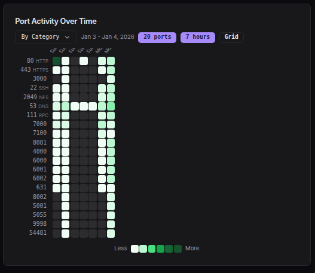

- X-axis: Time
- Y-axis: Port numbers
- Color intensity: Number of observations

Useful for spotting patterns like services that only run during business hours.

### 7.5 GeoIP Section

If you've scanned external IP addresses, the GeoIP section shows:

- **World Map** - Geographic distribution of targets
- **Country Table** - Breakdown by country
- **ASN Table** - Breakdown by autonomous system
- **IP Type Chart** - Distribution of IP types (residential, datacenter, etc.)

## 8. Settings

The Settings page allows you to configure Alicorn's behavior.

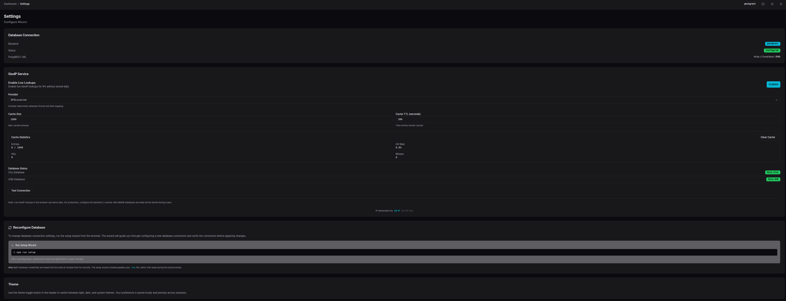

### 8.1 Database Connection

Displays the current database connection status:

- **Backend** - Always "postgrest"
- **Status** - Configured or Not Configured
- **PostgREST URL** - The API endpoint being used

### 8.2 GeoIP Service

Configure live GeoIP lookups for IP addresses:

- **Enable Live Lookups** - Toggle live GeoIP resolution
- **Provider** - Select your MMDB provider:
  - MaxMind GeoIP2/GeoLite2
  - IPinfo (MMDB format)
  - IP2Location
- **Cache Size** - Maximum number of cached lookups
- **Cache TTL** - How long entries remain cached (seconds)

The cache statistics panel shows hit rate and usage.

> **Note**: Live GeoIP lookups in the browser use demo data. For production use,
> configure the backend scanner with MMDB databases and GeoIP data will be
> stored during scans.

### 8.3 Reconfiguring the Database

To change database connection settings, use the CLI wizard:

```bash
npm run setup
```

The wizard guides you through configuring a new database connection. After
reconfiguration, rebuild and restart the application.

### 8.4 Theme

Use the theme toggle button in the header (sun/moon icon) to switch between:

- **Light** - Light background, dark text
- **Dark** - Dark background, light text (default)
- **System** - Follows your OS preference

Your preference is saved locally and persists across sessions.

---

## Quick Reference

### Keyboard Shortcuts

| Shortcut | Action                    |
|----------|---------------------------|
| `/`      | Focus search (on list pages) |
| `Esc`    | Clear selection / Close modal |

### URL Patterns

| URL                          | Purpose                        |
|------------------------------|--------------------------------|
| `/`                          | Dashboard                      |
| `/scans`                     | Scan list                      |
| `/scans/:id`                 | Scan detail                    |
| `/scans/compare?ids=1,2,3`   | Compare scans 1, 2, and 3      |
| `/hosts`                     | Host list                      |
| `/hosts/:ip`                 | Host detail by IP              |
| `/topology`                  | Global topology                |
| `/topology?scan_id=123`      | Topology for scan 123          |
| `/statistics`                | Statistics page                |
| `/settings`                  | Settings page                  |

### Export Formats

| Format   | Best For                              |
|----------|---------------------------------------|
| CSV      | Spreadsheets, data analysis           |
| JSON     | Programmatic processing, APIs         |
| Markdown | Documentation, reports, wikis         |

